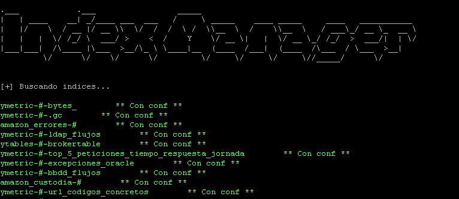
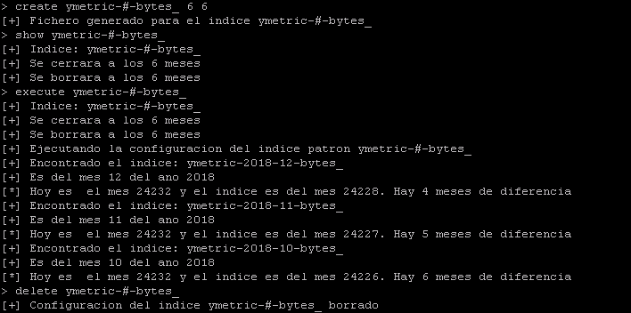
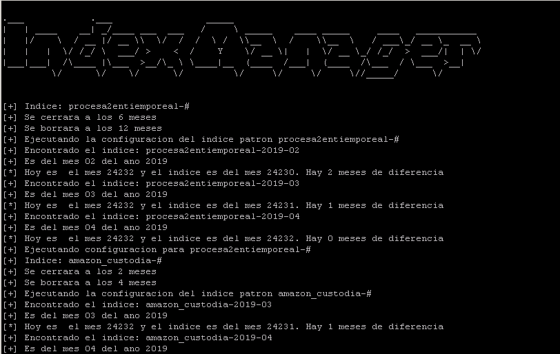

# Elastic-Index-Manager

La herramienta detecta index patterns que contienen la estructura {año}/{mes} o {mes}/{año} y permite gestionar cuanto tiempo tiene que pasar que sean cerrados o borrados. Es decir, extrae la fecha mirando el nombre del indice y compara con la fecha actual para que, dependiendo de su antigüedad, cerrar o borrar los indices que excedan los tiempos configurados.

Al arrancar hace una petición al servidor de elastic e identifica los patrones de indices compatibles:

Con los patrones detectados podemos usar los comandos disponibles:
- **create {patron_indices} {meses_para_cerrar} {meses_para_borrar}** 
 Genera un fichero de configuración guardando los meses que tienen que pasar para cerrar y para borrar los indices que cumplan ese patrón de indice.
- **show {patron_indice}** 
 Muestra la configuración de un patrón de indice
- **delete {patron_indice}** 
 Borra la configuración para un patrón de indice
- **execute {patron_indice}** 
 Ejecuta la configuración de un patrón de indice y borra/cierra los indices que excedan el tiempo configurado.
 
 

Para ejecutar todas las configuraciones se puede usar el comando:
**./indexManager.py execute**

